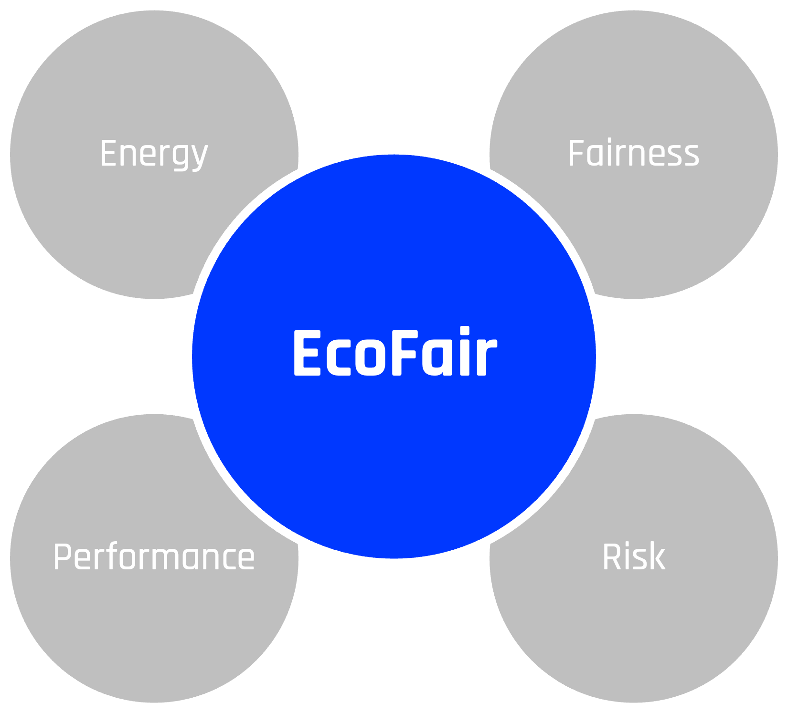
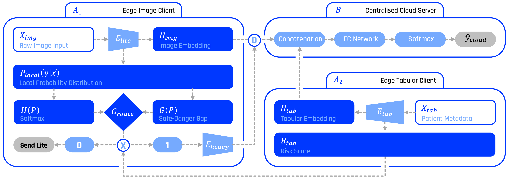
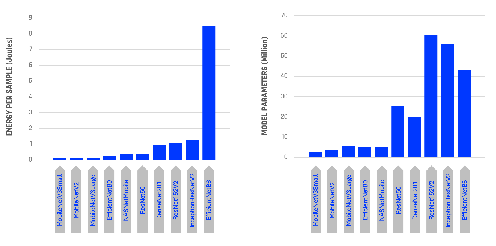

# EcoFair: Energy-Aware and Fair Dynamic Inference for Federated Medical AI

EcoFair is a Vertical Federated Learning (VFL) framework for skin lesion diagnosis that dynamically routes each patient case between a lightweight and a heavyweight model. It targets three goals at once: clinical accuracy, energy efficiency, and demographic fairness, without requiring access to raw images at inference time.

<!-- Make the image appear smaller by setting width via HTML -->
<p align="center">
  
</p>

---

## System Design

- **Offline (once):** The [feature extraction](feature_extraction/) step runs lite and heavy image encoders on each dataset, saving feature arrays and **measured energy per sample** (joules) per model and dataset. That energy data is stored and consumed by the main pipeline so that accuracy, routing, and battery impact are evaluated with real measurements. Energy tracking is a core part of the architecture.
- **At inference:** For each sample, a tabular client handles metadata (age, sex, localization) and a VFL server fuses image embeddings with tabular features to produce a diagnosis probability vector.
- **Routing:** A three-tier gate decides per sample whether to use only the lite path or to escalate to the heavy model: (1) **Uncertainty** – lite output entropy above a normalised threshold; (2) **Ambiguity** – small gap between safe vs dangerous class probabilities; (3) **Safety** – neurosymbolic risk (age × localization malignancy rate) above a clinical threshold. If any gate fires, the heavy model is used.



---

## Model Architecture

Lite and heavy branches share the same VFL layout: image adapter, tabular client, and shared server head. They differ only in the source of image features. The feature extractors support several lite and heavy backbones; the main pipeline uses **MobileNetV3Small** (lite) and **ResNet50** (heavy) as the default pair because they are among the smallest in their categories, giving a clear accuracy vs efficiency trade-off.



---

## Datasets

EcoFair is validated on three public dermatology datasets with different acquisition settings.

### HAM10000
Part of the [ISIC 2019 Challenge](https://challenge.isic-archive.com/data/#2019). Dermoscopic images from controlled clinical conditions. Seven classes; structured metadata (age, sex, localization) with high completeness.

> Tschandl P. et al. *The HAM10000 dataset.* Sci. Data 5, 180161 (2018).

### BCN20000
Also from the [ISIC 2019 Challenge](https://challenge.isic-archive.com/data/#2019). Dermoscopic images from Hospital Clínic de Barcelona. Eight classes; train/test split. Heterogeneous lighting and acquisition make it a good domain-shift benchmark. Actinic Keratosis (`ak`) is treated as safe/pre-malignant (consistent with PAD-UFES-20's `ack`), since both datasets separate it from the malignant SCC class.

> Hernández-Pérez C. et al. *BCN20000: Dermoscopic lesions in the wild.* Sci. Data 11, 641 (2024).

### PAD-UFES-20
[Mendeley Data](https://data.mendeley.com/datasets/zr7vgbcyr2/1). Clinical images from smartphones at a public dermatology clinic in Brazil. Six classes, ~58% biopsy-proven. Variable resolution and illumination; rich metadata (Fitzpatrick type, lesion diameter, age, sex, localization). Actinic Keratosis (`ack`) is treated as safe/pre-malignant since it is explicitly separated from the malignant SCC class in this dataset.

> Pacheco A. G. C. et al. *PAD-UFES-20.* Mendeley Data (2020).

---

## Notebooks

Each dataset has a self-contained Kaggle notebook at the repo root. All three follow the same structure; only paths and class lists change.

| Notebook | Dataset | Classes |
|---|---|---|
| [`ecofair-ham10k.ipynb`](ecofair-ham10k.ipynb) | HAM10000 | 7 |
| [`ecofair-pad-ufes-20.ipynb`](ecofair-pad-ufes-20.ipynb) | PAD-UFES-20 | 6 |
| [`ecofair-bcn20k.ipynb`](ecofair-bcn20k.ipynb) | BCN20000 | 8 |

Each notebook runs 5-fold CV and reports Pure Lite, Pure Heavy, and EcoFair accuracy; routing rate and energy per sample; confusion matrices; class-wise and subgroup (age, gender) accuracy; risk-stratified accuracy; battery projection; and a fairness audit (Equal Opportunity TPR, Demographic Parity).

---

## Results

All results are from 5-fold stratified group cross-validation. Full per-fold logs, confusion matrices, and fairness visualizations are available in each notebook.

### Classification Accuracy

| Dataset | Lite | Heavy | EcoFair | Routing Rate |
|---------|------|-------|---------|--------------|
| HAM10000 | 0.7406 ± 0.0126 | 0.7513 ± 0.0065 | **0.7617 ± 0.0111** | 29.9% ± 1.8% |
| PAD-UFES-20 | 0.6532 ± 0.0218 | 0.6783 ± 0.0245 | **0.6693 ± 0.0240** | 55.3% ± 2.8% |
| BCN20000 | **0.5572 ± 0.0182** | 0.5448 ± 0.0121 | 0.5562 ± 0.0182 | 51.7% ± 2.6% |

On HAM10000, EcoFair achieves the highest accuracy (+2.1 pp over Lite, +1.4 pp over Heavy) by routing only 30% of samples to the heavy model. On PAD and BCN, EcoFair sits between Lite and Heavy accuracy while substantially reducing inference cost relative to always using the heavy model.

### Energy Efficiency

Energy per sample is measured empirically during feature extraction and carried through the pipeline.

| Dataset | Lite (J/sample) | Heavy (J/sample) | EcoFair (J/sample) | Saving vs Heavy |
|---------|----------------|------------------|-------------------|-----------------|
| HAM10000 | ~0.27 | ~0.27 | 0.27 ± 0.00 | 0% (models matched on this GPU) |
| PAD-UFES-20 | ~0.14 | ~0.41 | 0.29 ± 0.01 | ~29% |
| BCN20000 | ~0.13 | ~0.41 | 0.27 ± 0.01 | ~33% |

On PAD and BCN, routing only the ambiguous and high-risk cases to the heavy model reduces energy consumption by roughly 29-33% compared to always running the heavier encoder, while maintaining accuracy above the lite-only baseline. On HAM10000 both encoders consumed comparable energy on the evaluation GPU, so the gain there is accuracy rather than energy.

### Fairness (Subgroup Macro TPR on Dangerous Classes)

The table below shows macro-averaged Equal Opportunity TPR across demographic subgroups (age and sex), restricted to dangerous/malignant classes. A smaller gap indicates more equitable detection across groups.

| Dataset | Model | Macro TPR Mean | Worst Group TPR | Fairness Gap |
|---------|-------|----------------|-----------------|--------------|
| HAM10000 | Lite | 0.6105 | 0.5751 | 0.1025 |
| HAM10000 | EcoFair | **0.6158** | **0.5796** | **0.0980** |
| HAM10000 | Heavy | 0.6137 | 0.5781 | 0.1054 |
| PAD-UFES-20 | Lite | **0.5294** | **0.4000** | 0.1788 |
| PAD-UFES-20 | EcoFair | 0.5288 | **0.4000** | 0.1940 |
| PAD-UFES-20 | Heavy | 0.4956 | 0.3000 | 0.2690 |
| BCN20000 | Lite | **0.4282** | **0.3612** | **0.1464** |
| BCN20000 | EcoFair | 0.4179 | 0.3241 | 0.1782 |
| BCN20000 | Heavy | 0.4077 | 0.2921 | 0.2014 |

On HAM10000, EcoFair achieves the highest mean TPR and tightest fairness gap across all models. On PAD and BCN, EcoFair consistently outperforms the heavy-only baseline on both worst-group TPR and fairness gap, maintaining malignancy detection closer to the lite model's performance while reducing energy.

---

## Repository Structure

```
ecofair-ham10k.ipynb       # Main pipeline (HAM10000)
ecofair-pad-ufes-20.ipynb  # Main pipeline (PAD-UFES-20)
ecofair-bcn20k.ipynb       # Main pipeline (BCN20000)

feature_extraction/        # Embedding + energy extraction (run before main pipeline)
├── image-feature-extractor-lite.ipynb
├── image-feature-extractor-heavy.ipynb
└── README.md

src/
├── config.py          # Global hyperparameters only
├── data_loader.py     # Dataset-agnostic feature & metadata alignment
├── features.py        # Neurosymbolic risk scoring & tabular feature engineering
├── models.py          # VFL model architecture
├── training.py        # Cross-validation pipeline
├── routing.py         # Entropy, threshold, and budget routing logic
├── fairness.py        # Subgroup fairness metrics
├── visualization.py   # All plotting functions
└── utils.py           # Seed control, energy stats loading
```

The `src/` backend is dataset-agnostic. All dataset-specific settings (paths, class names, safe/dangerous lists, required metadata columns) live in the front-end notebooks and are passed in as arguments.
