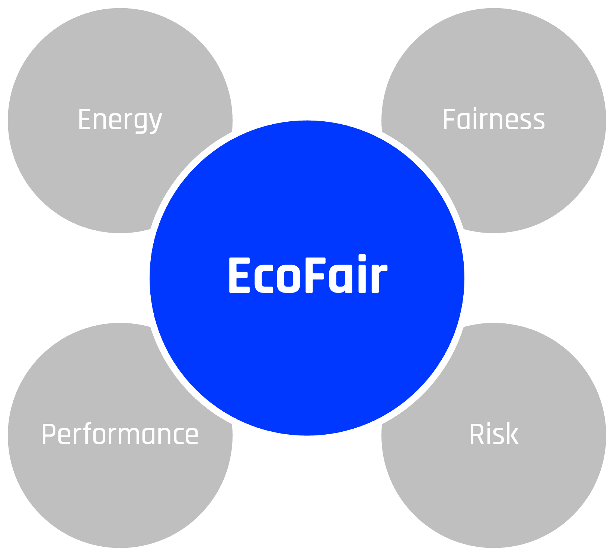
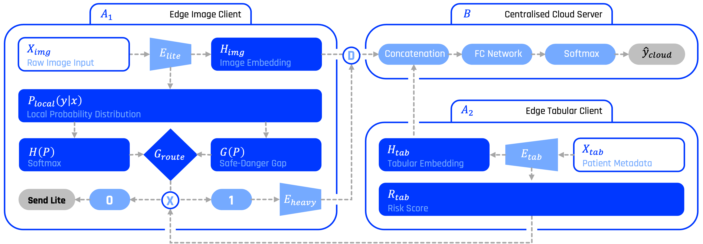
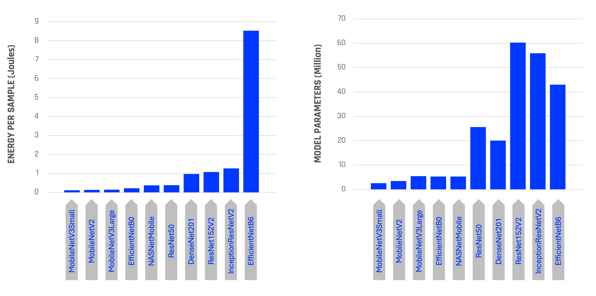
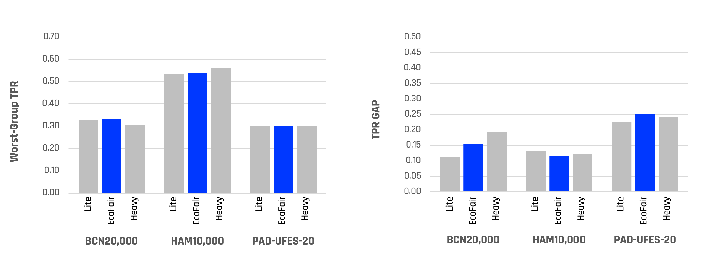
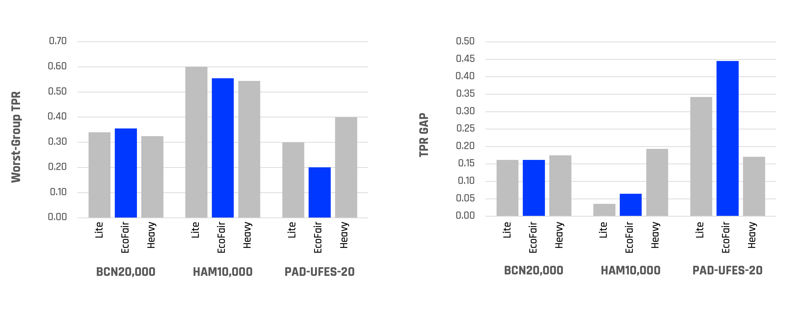
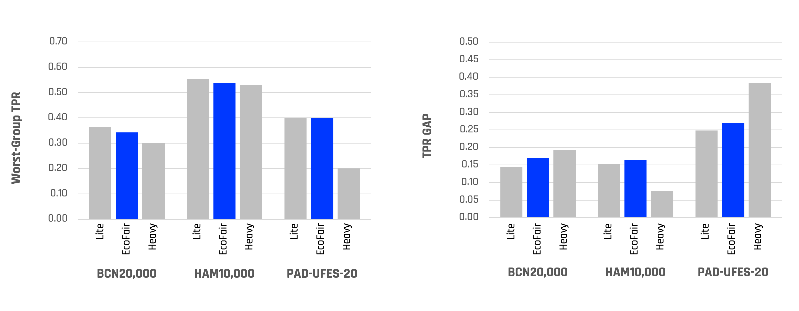

# EcoFair: Trustworthy and Energy-Aware Routing for Privacy-Preserving Vertically Partitioned Medical Inference

EcoFair is a privacy-preserving Vertical Federated Learning framework for skin‑lesion diagnosis.  
Each patient case is first processed by a **lite model on the edge image client**; the **heavy model** (also resident on the image client) is activated selectively only when the routing gate triggers. Raw images and raw tabular records are never transmitted — only compact embeddings are sent to the server for multimodal fusion.

The framework jointly optimises:

- **Clinical accuracy** — malignant-class detection across dangerous skin lesion categories,
- **Energy efficiency** — across the full edge-to-cloud inference path,
- **Demographic fairness** — across age and sex subgroups, and
- **Neurosymbolic risk-awareness** — integrating expert-derived risk scores from age and anatomical site metadata.

<p align="center">
  
</p>

---

## 1. System Overview

**Offline feature extraction (once per dataset):**  
The notebooks in [`feature_extraction/`](feature_extraction/) run lite and heavy CNN backbones over each dataset and record image embeddings alongside an `energy_stats.json` file per model. The lite model's energy figures reflect the physical power constraints of low-power edge hardware (e.g. Raspberry Pi class devices). The heavy model's energy is measured on GPU using `pynvml`. Both are consumed by the pipeline notebooks to produce hardware-grounded energy metrics.

**Online inference:**  
The lite backbone runs entirely on the **edge image client**; raw images remain local and are never transmitted. The lite model produces an image embedding and an initial diagnosis probability vector. The tabular client (also on the edge node) encodes patient metadata — age, sex, anatomical site, neurosymbolic risk score — into a second embedding. Both embeddings are forwarded to the **central server** for multimodal fusion via the shared server head.

**Neurosymbolic routing:**  
Before server submission, a three-tier gate on the edge decides whether the lite result alone is sufficient or whether the heavy model (also on the image client) should be activated:

- **Uncertainty** — softmax entropy of the lite output exceeds a normalised threshold,
- **Ambiguity** — the probability gap between safe and dangerous class mass is too small,
- **Safety** — a neurosymbolic risk score (age × anatomical-site malignancy rate) exceeds a clinical threshold.

If any gate fires, the heavy backbone is invoked on the image client, its embedding is transmitted alongside the lite embedding, and the server head produces an ensembled prediction. Otherwise only the lite path is used, saving energy.

<p align="center">
  
</p>

---

## 2. Repository Structure

```text
.
├── ecofair-ham.ipynb          # Pipeline notebook — HAM10000
├── ecofair-bcn.ipynb          # Pipeline notebook — BCN20000
├── ecofair-pad.ipynb          # Pipeline notebook — PAD‑UFES‑20
├── feature_extraction/
│   ├── image-feature-extractor-lite.ipynb   # Lite CNN extraction + edge energy profiling
│   ├── image-feature-extractor-heavy.ipynb  # Heavy CNN extraction + GPU energy profiling
│   └── README.md
└── src/                       # Backend modules — loaded by the pipeline notebooks
    ├── config.py              # Hyper-parameters and MODEL_PAIRS
    ├── data_loader.py         # Feature / metadata alignment and CV splits
    ├── features.py            # Neurosymbolic risk scoring and tabular feature engineering
    ├── models.py              # VFL model topology (adapters, tabular client, server head)
    ├── training.py            # 5-fold CV driver (multi-pair)
    ├── routing.py             # Threshold and budget routing, SafetyFirst optimiser
    ├── fairness.py            # Subgroup fairness metrics (EO TPR, DP rate)
    ├── visualization.py       # All figures (confusion matrices, Pareto, fairness, etc.)
    └── utils.py               # Seeds, energy loading, CSV I/O
```

The `src/` modules are dataset-agnostic and serve as the backend for all three pipeline notebooks. All dataset-specific configuration — paths, class lists, safe/dangerous splits — is defined at the top of each notebook.

---

## 3. Datasets

| Dataset | Setting | Classes | Notes |
|---------|---------|---------|-------|
| [HAM10000](https://challenge.isic-archive.com/data/#2019) | Dermoscopic, in-domain | 7 | Structured metadata; high completeness |
| [BCN20000](https://challenge.isic-archive.com/data/#2019) | Dermoscopic, domain-shift | 8 | Heterogeneous acquisition; train/test CSV split |
| [PAD‑UFES‑20](https://data.mendeley.com/datasets/zr7vgbcyr2/1) | Clinical smartphone | 6 | ~58 % biopsy-proven; rich metadata including Fitzpatrick type |

For all three datasets, dangerous/malignant classes are `mel`, `bcc`, `scc` (and `akiec` on HAM10000); safe classes are the remaining non-malignant categories.

---

## 4. Model Architecture

Lite and heavy branches share the same VFL topology — only the backbone CNN differs. Both lite and heavy backbones run on the **edge image client**; only embeddings are sent to the server.

| Component | Role | Side |
|-----------|------|------|
| Image adapter | Maps frozen CNN features → 128-D embedding | Edge image client |
| Tabular client | Encodes age, sex, localization, risk score → 128-D | Edge |
| Server head | Concatenates both embeddings → per-class logits | Server |

Model pairs evaluated (configured in `src/config.py`):

| Role | Backbones |
|------|-----------|
| Lite (edge image client) | MobileNetV2, MobileNetV3Small |
| Heavy (edge image client) | ResNet50, DenseNet201, EfficientNetB6 |

<p align="center">
  
</p>

---

## 5. Results

Each pipeline notebook runs the full EcoFair pipeline for **three lite→heavy model pairs** under 5-fold stratified group cross-validation. Outputs are written to `output/<DATASET>/` (e.g. `ham_cv_results.csv`, `bcn_energy_metrics.csv`, `pad_fairness_summary.csv`).

### 5.1. Performance (5-fold CV, mean ± std)

| Dataset | Pair | Model | Macro F1 | Balanced Acc | Malignant Recall |
|---------|------|-------|----------|--------------|------------------|
| HAM10000 | MobileNetV2 → ResNet50 | Lite | 0.5305 ± 0.0212 | 0.5932 ± 0.0324 | 0.5442 ± 0.0467 |
| HAM10000 | MobileNetV2 → ResNet50 | Heavy | 0.5855 ± 0.0177 | 0.6431 ± 0.0227 | 0.5998 ± 0.0308 |
| HAM10000 | MobileNetV2 → ResNet50 | EcoFair | 0.5629 ± 0.0124 | 0.6224 ± 0.0230 | 0.5519 ± 0.0299 |
| HAM10000 | MobileNetV3Small → DenseNet201 | Lite | 0.5521 ± 0.0165 | 0.6244 ± 0.0165 | 0.6168 ± 0.0342 |
| HAM10000 | MobileNetV3Small → DenseNet201 | Heavy | 0.5837 ± 0.0118 | 0.6338 ± 0.0288 | 0.5802 ± 0.0206 |
| HAM10000 | MobileNetV3Small → DenseNet201 | EcoFair | 0.5774 ± 0.0222 | 0.6440 ± 0.0262 | 0.5882 ± 0.0477 |
| HAM10000 | MobileNetV3Small → EfficientNetB6 | Lite | 0.5568 ± 0.0205 | 0.6285 ± 0.0235 | 0.5793 ± 0.0335 |
| HAM10000 | MobileNetV3Small → EfficientNetB6 | Heavy | 0.5468 ± 0.0182 | 0.6141 ± 0.0171 | 0.5714 ± 0.0142 |
| HAM10000 | MobileNetV3Small → EfficientNetB6 | EcoFair | 0.5784 ± 0.0163 | 0.6506 ± 0.0157 | 0.5850 ± 0.0251 |
| BCN20000 | MobileNetV2 → ResNet50 | Lite | 0.3750 ± 0.0355 | 0.3988 ± 0.0399 | 0.4152 ± 0.0538 |
| BCN20000 | MobileNetV2 → ResNet50 | Heavy | 0.3816 ± 0.0261 | 0.4094 ± 0.0284 | 0.4587 ± 0.0281 |
| BCN20000 | MobileNetV2 → ResNet50 | EcoFair | 0.3908 ± 0.0321 | 0.4165 ± 0.0362 | 0.4430 ± 0.0427 |
| BCN20000 | MobileNetV3Small → DenseNet201 | Lite | 0.3819 ± 0.0157 | 0.4437 ± 0.0237 | 0.4706 ± 0.0293 |
| BCN20000 | MobileNetV3Small → DenseNet201 | Heavy | 0.3748 ± 0.0177 | 0.4012 ± 0.0186 | 0.4632 ± 0.0402 |
| BCN20000 | MobileNetV3Small → DenseNet201 | EcoFair | 0.3940 ± 0.0200 | 0.4566 ± 0.0261 | 0.4750 ± 0.0387 |
| BCN20000 | MobileNetV3Small → EfficientNetB6 | Lite | 0.3922 ± 0.0297 | 0.4311 ± 0.0235 | 0.4732 ± 0.0380 |
| BCN20000 | MobileNetV3Small → EfficientNetB6 | Heavy | 0.3774 ± 0.0193 | 0.4123 ± 0.0207 | 0.4594 ± 0.0234 |
| BCN20000 | MobileNetV3Small → EfficientNetB6 | EcoFair | 0.4015 ± 0.0323 | 0.4419 ± 0.0218 | 0.4658 ± 0.0345 |
| PAD‑UFES‑20 | MobileNetV2 → ResNet50 | Lite | 0.5986 ± 0.0170 | 0.6090 ± 0.0064 | 0.5261 ± 0.0370 |
| PAD‑UFES‑20 | MobileNetV2 → ResNet50 | Heavy | 0.6228 ± 0.0331 | 0.6360 ± 0.0279 | 0.5365 ± 0.0479 |
| PAD‑UFES‑20 | MobileNetV2 → ResNet50 | EcoFair | 0.6157 ± 0.0253 | 0.6243 ± 0.0286 | 0.5384 ± 0.0643 |
| PAD‑UFES‑20 | MobileNetV3Small → DenseNet201 | Lite | 0.6128 ± 0.0177 | 0.6647 ± 0.0250 | 0.6267 ± 0.0676 |
| PAD‑UFES‑20 | MobileNetV3Small → DenseNet201 | Heavy | 0.6147 ± 0.0265 | 0.6315 ± 0.0144 | 0.5447 ± 0.0425 |
| PAD‑UFES‑20 | MobileNetV3Small → DenseNet201 | EcoFair | 0.6351 ± 0.0231 | 0.6722 ± 0.0274 | 0.6283 ± 0.0452 |
| PAD‑UFES‑20 | MobileNetV3Small → EfficientNetB6 | Lite | 0.6147 ± 0.0415 | 0.6549 ± 0.0402 | 0.6280 ± 0.0638 |
| PAD‑UFES‑20 | MobileNetV3Small → EfficientNetB6 | Heavy | 0.6016 ± 0.0285 | 0.6292 ± 0.0202 | 0.5561 ± 0.0261 |
| PAD‑UFES‑20 | MobileNetV3Small → EfficientNetB6 | EcoFair | 0.6374 ± 0.0357 | 0.6756 ± 0.0310 | 0.6450 ± 0.0435 |

### 5.2. Energy (J/sample, routing %, savings vs Heavy)

| Dataset | Pair | Lite (J) | Heavy (J) | EcoFair (J) | Routing (%) | Savings (%) |
|---------|------|----------|-----------|-------------|-------------|-------------|
| HAM10000 | MobileNetV2 → ResNet50 | 0.18 | 0.39 | 0.28 ± 0.01 | 26.63 ± 2.82 | 28.09 ± 2.82 |
| HAM10000 | MobileNetV3Small → DenseNet201 | 0.18 | 0.84 | 0.46 ± 0.02 | 33.32 ± 1.96 | 45.43 ± 1.96 |
| HAM10000 | MobileNetV3Small → EfficientNetB6 | 0.18 | 9.62 | 3.07 ± 0.48 | 30.04 ± 5.02 | 68.09 ± 5.02 |
| BCN20000 | MobileNetV2 → ResNet50 | 0.19 | 0.36 | 0.40 ± 0.03 | 57.36 ± 7.75 | -10.09 ± 7.75 |
| BCN20000 | MobileNetV3Small → DenseNet201 | 0.18 | 0.85 | 0.65 ± 0.04 | 54.91 ± 4.12 | 24.27 ± 4.12 |
| BCN20000 | MobileNetV3Small → EfficientNetB6 | 0.18 | 2.50 | 1.61 ± 0.11 | 57.10 ± 4.59 | 35.80 ± 4.59 |
| PAD‑UFES‑20 | MobileNetV2 → ResNet50 | 0.20 | 0.37 | 0.40 ± 0.01 | 54.28 ± 2.66 | -7.73 ± 2.66 |
| PAD‑UFES‑20 | MobileNetV3Small → DenseNet201 | 0.18 | 0.84 | 0.64 ± 0.03 | 55.24 ± 3.31 | 23.86 ± 3.31 |
| PAD‑UFES‑20 | MobileNetV3Small → EfficientNetB6 | 0.18 | 8.49 | 4.93 ± 0.25 | 56.04 ± 2.96 | 41.90 ± 2.96 |

### 5.3. Fairness summary (Worst-Group TPR, TPR Gap)

Per-pair fairness bar charts comparing Lite, EcoFair, and Heavy across the three datasets:

<p align="center">
  
</p>

<p align="center">
  
</p>

<p align="center">
  
</p>

Additional outputs per notebook: subgroup accuracy, Equal Opportunity, Demographic Parity tables; confusion matrices; clinical safety plots; Pareto frontier (energy vs worst-group TPR).

---

## 6. Reproducing the Experiments

All notebooks are designed to run on a Jupyter-compatible platform (Kaggle, JupyterLab, VS Code, Google Colab).

**Step 1 — Extract features:**  
Open and run [`image-feature-extractor-lite.ipynb`](feature_extraction/image-feature-extractor-lite.ipynb) and [`image-feature-extractor-heavy.ipynb`](feature_extraction/image-feature-extractor-heavy.ipynb) for each dataset. Each notebook writes `features.npy`, `ids.npy`, and `energy_stats.json` under `output/<DATASET>/<MODEL>/`. See [`feature_extraction/README.md`](feature_extraction/README.md) for details.

**Step 2 — Run the pipeline:**  
Open the relevant pipeline notebook and execute all cells:

| Notebook | Dataset |
|----------|---------|
| [`ecofair-ham.ipynb`](ecofair-ham.ipynb) | HAM10000 |
| [`ecofair-bcn.ipynb`](ecofair-bcn.ipynb) | BCN20000 |
| [`ecofair-pad.ipynb`](ecofair-pad.ipynb) | PAD‑UFES‑20 |

Update the path constants at the top of each notebook to point to your local dataset locations and the feature extraction outputs from Step 1.

---